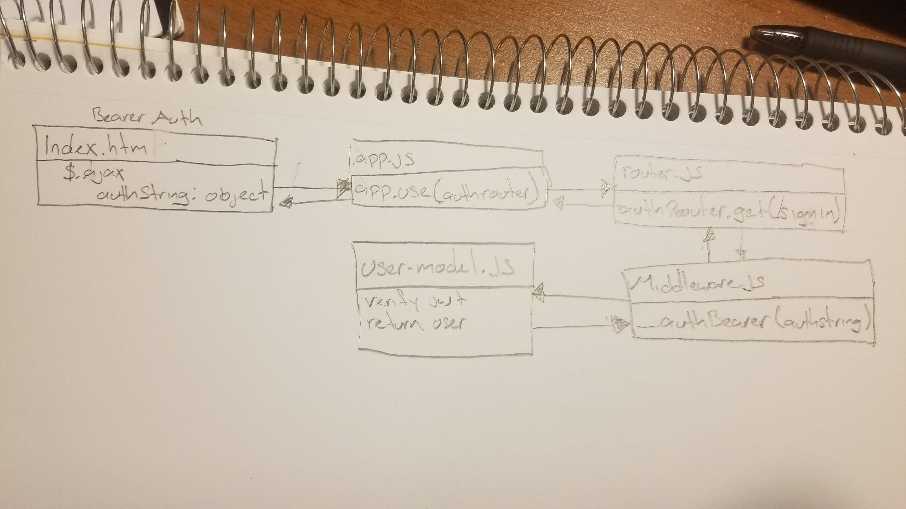

# lab13-bearer-authorization

## Author: Felipe Delatorre

### Links and Resources
* [submission PR](https://github.com/401-advanced-javascript-felipe/lab13-bearer-authorization/pull/1)
* [travis](https://travis-ci.com/401-advanced-javascript-felipe/lab13-bearer-authorization)

### Setup
#### `.env` requirements
* `PORT` - Port Number
* `MONGODB_URI` - URL to the running mongo instance/db
* `SECRET` - a secret for jwt
* `TIMEOUT` - a testing timeout

#### Running the app
* `npm start`  

#### UML

